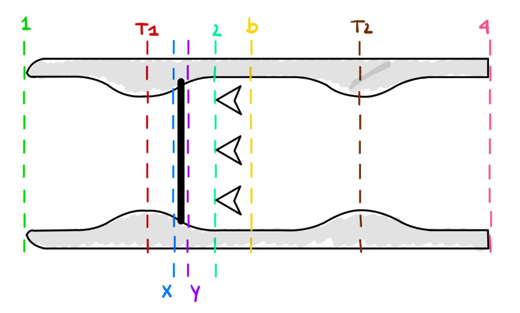

# 🚀 Ramjet Engine Simulation

This program was developed under the course Space Launchers from Instituto Superior Técnico.
A Python-based simulation tool to model the performance of a ramjet engine - find the software assumptions in the full report below.

## 🔧 Features

- Computes **engine station parameters** (areas, temperatures, pressures)
- Supports **isentropic & shock flow analysis**
- Calculates:
  - Thermal efficiency (based on Brayton cycle assumptions)
  - Propulsive efficiency
  - Total efficiency
- Plots:
  - Temperature and pressure variation along the engine
  - Temperature vs. entropy change ($T$–$\Delta s$ diagram)
- Built-in **parametric study**:
  - Vary Mach number, burner temperature, shock strength, thrust, etc.
- Easy-to-use **menu interface** via terminal

📄 [Download Full Report (PDF)](Ramjet_Program/Report.pdf)

## 📂 Project Structure

```
Ramjet_Program/
│
├── ramjet.py             # Core calculations
├── main.py               # Menu + plotting + parametric study
├── ramjet_stations.png   # Engine station diagram
└── README.md             # You're here 🚀
```

## ▶️ How to Run

```bash
python main.py
```

Then choose from the terminal menu:
- Option 1: Analyze a custom design case by entering engine parameters
- Option 2: Run a parametric study across a chosen variable - Check the code for what are the constant values of the remaining variables

### Dependencies:
- `numpy`
- `matplotlib`

## 📸 Visual Overview

The diagram below illustrates engine stations used in the calculations:

- 1: Inlet
- T1: After isentropic compression
- x/y: Before and after shock
- 2: Burner entry
- b: Burner exit
- T2: Nozzle throat
- 4: Exhaust
<p align="center">
  
</p>

## 👨‍💻 Author

Rafael [@rafacoimbratec]  
---

📘 Literature:

**Aircraft Propulsion** by Saeed Farokhi (2nd Ed.)

J. D. Anderson, **Modern Compressible Flow**: With Historical Perspective, 3rd Edition, McGraw-Hill
Education, New York, 2002.

Antonella Ingenito, **Subsonic Combustion Ramjet Design**, Springer, 2021.


